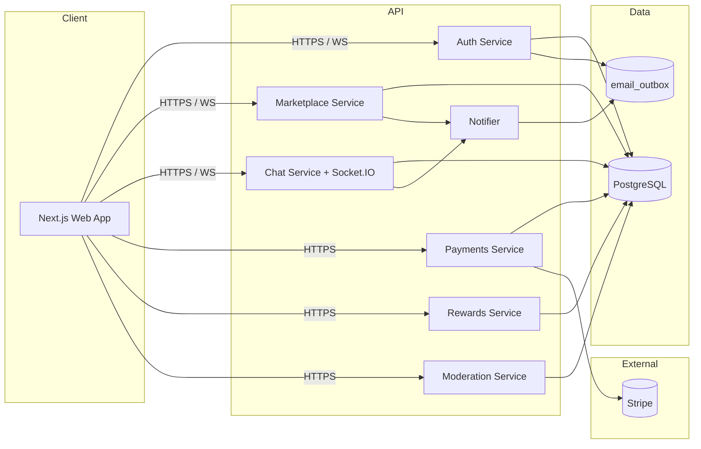

# Architecture Notes

This repository is an npm-workspaces monorepo for a bilingual UGC influencer
marketplace targeting CIS micro-creators and small brands.

## Workspaces

- `apps/web` — Next.js 15 frontend (React 19, App Router).
- `apps/api` — Node.js 22 + TypeScript API (Express + Socket.IO).

## High-level diagram



## Service responsibilities

| Service     | Responsibility                                                                                                                                         |
| ----------- | ------------------------------------------------------------------------------------------------------------------------------------------------------ |
| Auth        | Registration, email verification, login (JWT access + rotated refresh cookie), password reset, parental consent, account export/delete, rate limiting. |
| Marketplace | Brand campaigns, creator profiles, feeds, swipe interactions, matches, favorites.                                                                      |
| Chat        | Threads (one per match), messages, read receipts, real-time delivery via Socket.IO.                                                                    |
| Payments    | User balances, escrow holds, deliverables, payouts, Stripe webhooks.                                                                                   |
| Rewards     | Referral codes, ledger credits, badges, XP/levels, leaderboard.                                                                                        |
| Moderation  | User ban/unban, campaign moderation, abuse reports, action log.                                                                                        |
| Notifier    | Side-effect entry point for matches and new chat messages. Default impl writes to the email outbox; replace with SendGrid/FCM in production.           |

## Setup boundaries

- `apps/web` does not import from `apps/api`; the contract is the HTTP API.
- Secrets must never be committed. `.env.example` files are the source of truth.
- Schemas are initialized on API startup via `initializeAuthSchema`. We rely
  on `ADD COLUMN IF NOT EXISTS` for forward compatibility; switching to a
  real migration tool (drizzle-kit / node-pg-migrate) is planned.

## Local services

`docker-compose.yml` defines local containers for the web app, API,
PostgreSQL, and Redis. Redis is reserved for future use (pub/sub fanout for
chat / push notifications).

## Auth

Auth uses PostgreSQL tables initialized by the API on startup.

- Access tokens: short-lived JWTs (default 15 min).
- Refresh tokens: opaque secrets stored hashed; rotated on every `/auth/refresh`.
- Refresh sessions live in an HttpOnly cookie scoped to `/auth`.
- Verification + password reset emails are written to the dev outbox until
  a real email provider is wired in.
- Brute-force protection: in-memory sliding-window limiter on `/auth/login`,
  `/auth/register`, `/auth/forgot-password`, `/auth/verify-email`.

### Age gating

- Users may optionally provide `dateOfBirth` at registration.
- Anyone under 13 is rejected with `UNDERAGE_NOT_ALLOWED`.
- Users 13–17 are considered minors. `requireAdultActions` blocks payments
  and direct messaging until they POST to `/auth/me/parental-consent` with a
  parent's email.

## Checks

The baseline CI contract is:

```bash
npm run ci
# = lint, format:check, typecheck, test, build
```

GitHub Actions runs this against a Postgres 16 service container so future
integration tests have a real database available.

## Open follow-ups

Tracked in [`docs/follow-ups.md`](./follow-ups.md). High-level summary:

- Social-API ingestion (YouTube, TikTok, VK) for verified audience size.
- Real media upload pipeline (S3 + presigned URLs + image/video moderation).
- YooKassa / ЮMoney adapter alongside Stripe for the RU market.
- Push notifications (Firebase Cloud Messaging) and a transactional email
  provider.
- Proper DB migration tool to replace `initializeAuthSchema`.
- Structured logging (pino) + Sentry / Prometheus.
